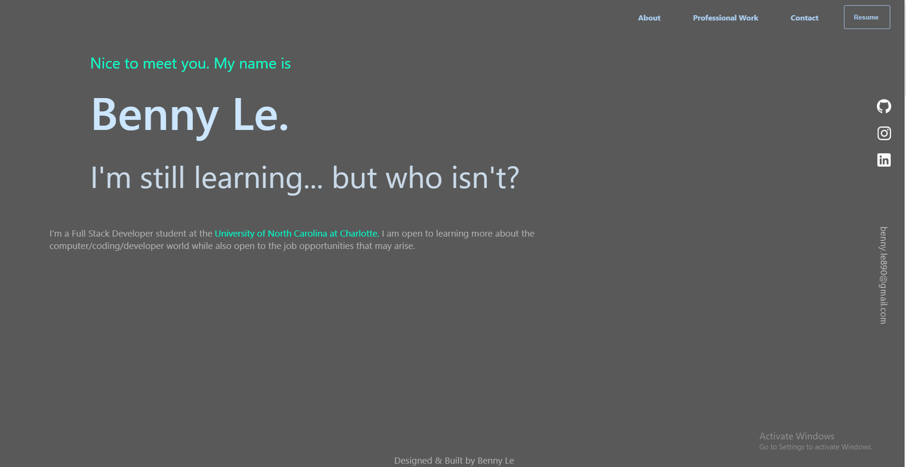

# React Professional Portfolio

  

  # Description
This is a professional portfolio utilizing react and other skills obtained throughout the course of UNCC's online bootcamp. Using these skills, the initial portfolio created in module 2 you are able to see similarities as well as improvements. There are more similarities between both modules however, it is because I tried to keep my Module 2 portfolio up to date. 

  # Table of Contents
  * [Installation](#installation)
  * [Usage](#usage)
  * [Questions](#questions)
  
  # Installation
  The following necessary dependencies must be installed to run the application

    npm install

  # Usage
  In order to use this app, you will need to make sure you have node.js installed to your Visual Studio Code. One you have installed the necessary dependancies, execute npm start to your application.  

  A link to the deployed application is found [here.](https://bennyle890.github.io/react-portfolio/)

 
  # Questions
  If you have any questions about the repository, please contact/email benny.le890@gmail.com  
  My GitHub profile is found at [GitHub Profile](https//GitHub.com/bennyle890)
